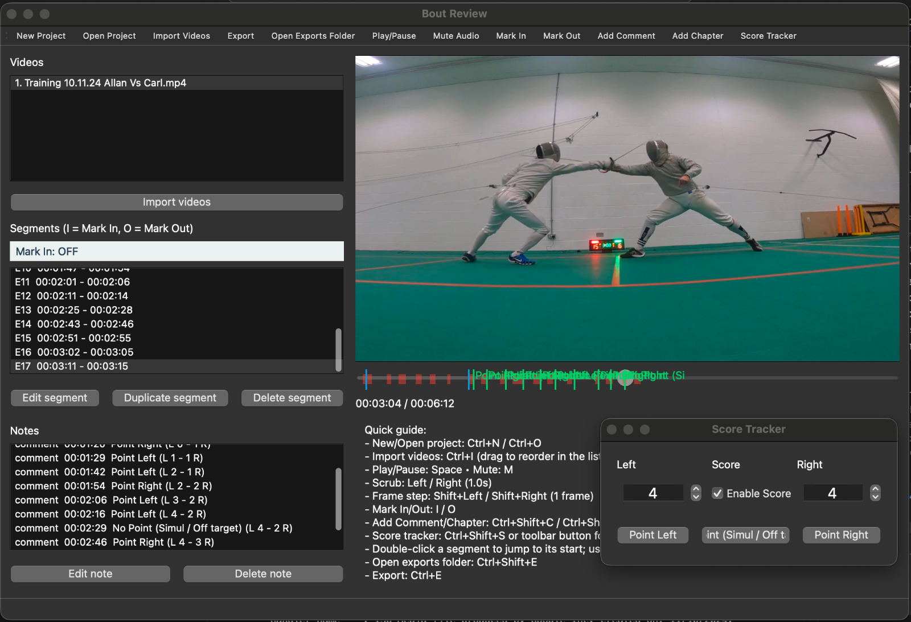

# Bout Review


Desktop app for reviewing fencing bouts: import videos, mark segments, add notes, and export highlights + chapter timestamps.

## What's new (v1.1)
- Score tracker window (always on top): log Point Left/Right/No Point, optionally auto-increment scores, and drop timestamped comments at the playhead.
- Per-segment playback speed: set slow/fast motion when editing or duplicating segments; speeds carry through to exported clips and stitched highlights.

## Instructions for use

- Launch the app.
- Create/open a project: click *New Project* or *Open Project*, and create a folder where you want the output files to be.
-Import videos: Select *Import Videos* and choose files. (If you have multiple videos, drag to reorder them in the display).
- Play: select a video; **spacebar** = play/pause, **M** = mute toggle.**Left/Right** arrows scrub seconds; **Shift+Left/Right** step frames.
- Mark segments: To Mark the action, at the start use **I** (Mark In), at end press **O** (Mark Out). Segments appear in the list; double-click to jump.
- [Optional] Edit/duplicate segments: select a segment > Edit segment (start/end/label/speed) or Duplicate segment.
- [Optional] notes: move playhead → Add Comment or Add Chapter; double-click a note to edit timestamp/type/text.
- [Optional] Score tracker: toolbar → Score Tracker (stays on top). Use Point Left/Right/No Point; with “Enable Score” checked, scores auto-increment and get appended to the comment. You can manually adjust the score boxes anytime.
- Export: click *Export*. Outputs go to exports/: `highlights.mp4` (`/clips/` contain individual segments, chapters and notes found in `youtube_chapters.txt`, `comments_timestamps.txt`. )
- Open exports folder: toolbar button or *Ctrl+Shift+E*.

## How To Install
Go to the releases page [https://github.com/CarlHentges/Bout-Review/releases](https://github.com/CarlHentges/Bout-Review/releases)

### Mac
1) Download the  `Bout_Review_Mac.zip` file.
2) Extract the file, now you can place the application where you like, for instance the applications folder. 
3) The app may be blocked from opening at first, if this happens go to *Settings > Privacy & Security* scroll down until you see the option to run anyway. It should run fine after this.

### Windows
1) Download `Bout_Review_Windows-x64.zip`
2) Extract the file, this is a portable windows application so can be run from anywhere (e.g loaded on a usb drive) but it must remain in its folder.
3) Create a shortcut, and move the shortcut to the desktop, if you wish to launch it directly from there.


## Development Notes

```bash
python3.11 -m venv .venv
source .venv/bin/activate
python -m pip install -U pip
pip install -e .
python -m bout_review
```

On first run, a `bout_review_config.json` is created in the repo root for colors + hotkeys.

### PyInstaller

1) Install build deps:
```bash
pip install pyinstaller pillow
```

2) Build:
```bash
pyinstaller BoutReview.spec
```

3) Result:
```
dist/Bout Review.app
```

4) Share with friends:
```bash
ditto -c -k --sequesterRsrc --keepParent "dist/Bout Review.app" "Bout Review.zip"
```
They can unzip and run. On first launch they may need to right-click → Open to bypass Gatekeeper (unsigned app).

### Notes
- The build bundles an FFmpeg binary from `imageio-ffmpeg` so no system FFmpeg install is needed.
- App icon uses `src/bout_review/assets/bout_review_icon.png` at runtime.

